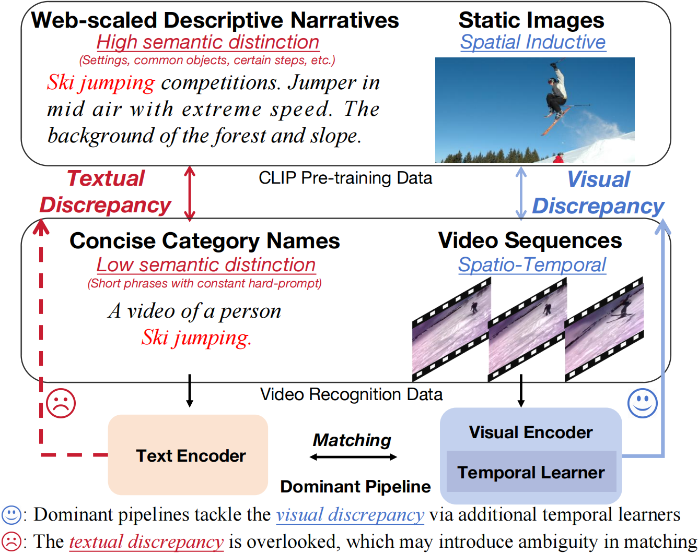
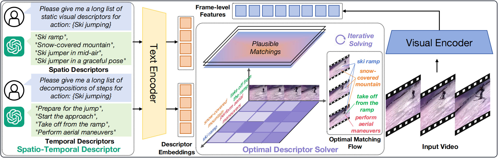

<div align="center">
<h1> OST: Refining Text Knowledge with Optimal Spatio-Temporal Descriptor for General Video Recognition </h1>

[[Project Page]](https://tomchen-ctj.github.io/OST/) [[arXiv]](https://arxiv.org/abs/) 

[Tongjia Chen](https://tomchen-ctj.github.io/)<sup>1</sup>, [Hongshan Yu]()<sup>1</sup>, [Zhengeng Yang](https://scholar.google.com/citations?user=26tsC5kAAAAJ&hl=en&oi=ao)<sup>2</sup>, [Zechuan Li](https://scholar.google.com/citations?user=b0GewmQAAAAJ&hl=en&oi=ao)<sup>1</sup>, [Wei Sun]()<sup>1</sup>, [Chen Chen](https://www.crcv.ucf.edu/chenchen/)<sup>3</sup>

<sup>1</sup>[HNU](https://www-en.hnu.edu.cn/), <sup>2</sup>[HNNU](https://english.hunnu.edu.cn/), <sup>3</sup>[CRCV, UCF](http://crcv.ucf.edu/)
</div>

In this work, we introduce a novel general video recognition pipeline **OST**. We prompt an LLM to augment category names into *Spatio-Temporal Descriptors* and refine the semantic knowledge via *Optimal Descriptor Solver*.

<div align=center>

</div>
Dominant pipelines propose to tackle the visual discrepancies with additional temporal learners while overlooking the textual discrepancy between descriptive narratives and concise category names. This oversight results in a less separable latent space, which may hinder video recognition.


<div align=center>

</div>

We query the Large Language Model to augment category names to generate corresponding *Category Descriptors*. The descriptors disentangled category names into *Spatio-Temporal Descriptors* for static visual cues and temporal evolution, respectively. To fully refine the textual knowledge, we propose *Optimal Descriptor Solver* that adaptively aligns descriptors with video frames. An optimal matching flow is calculated through the iterative solving of the entropy-regularized OT problem to assign optimal descriptors for each video instance.

## Todo

- [ ] Code Release

- [ ] Environment

- [ ] Checkpoint Release

- [ ] Check

## Citation

**OST: Refining Text Knowledge with Optimal Spatio-Temporal Descriptor for General Video Recognition**
Tongjia Chen, Hongshan Yu, Zhengeng Yang, Zechuan Li, Wei Sun, Chen Chen.
Preprint

```
@article{
    chen2023ost,
    title={OST: Refining Text Knowledge with Optimal Spatio-Temporal Descriptor for General Video Recognition},
    author={Tongjia Chen, Hongshan Yu, Zhengeng Yang, Zechuan Li, Wei Sun, Chen Chen.},
    booktitle={Preprint},
    year={2023}, 
 }
```

## Acknowledgment

The work was done while Tongjia was a research intern mentored by [Chen Chen](https://www.crcv.ucf.edu/chenchen/). We thank [Ming Li (UCF)](https://liming-ai.github.io/) and [Yong He (UWA)](https://scholar.google.com/citations?user=6mXfrTEAAAAJ&hl=en&oi=ao) for proof-reading and discussion.

This repository is built upon portions of [ViFi-CLIP](https://github.com/muzairkhattak/ViFi-CLIP), [MAXI](https://github.com/wlin-at/MAXI), and [Text4Vis](https://github.com/whwu95/Text4Vis/). We sincerely thank the authors for releasing their code.

